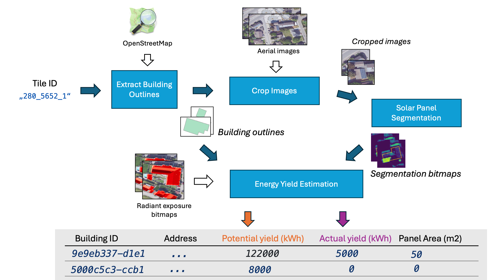

# Solar panel energy yield

Determine the solar panel energy yield in North Rhine Westphalia (NRW) using [OpenGeodata.NRW](https://www.opengeodata.nrw.de/produkte/) and OpenStreetMap.


## Overview

The approach is described in my [blog post](https://kopytjuk.github.io/posts/solar-panel-analysis/).



This project contains multiple command line tools (in order of execution):

1. `building-selector --help`
2. `image-cropper --help`
3. Solar panel segmentation (deep-learning based) is located in https://github.com/kopytjuk/solar-panel-segmentation
4. `energy-extractor --help`
5. `combine-results --help`


## Setup

This project uses [uv](https://docs.astral.sh/uv/) as a project manager.

```shell
uv sync

# and run a single tool
uv run building-selector --help
```

## Components

### Building Selector
Identifies and selects suitable building footprints from geospatial and OpenStreetMap data to determine candidates for subsequent solar panel analysis.

### Image Cropper
Extracts and preprocesses satellite imagery. It crops the areas of interest corresponding to the selected buildings, preparing high-quality inputs for further processing.

### Solar Panel Segmentation
A deep-learning based tool (located at [solar-panel-segmentation](https://github.com/kopytjuk/solar-panel-segmentation)) that segments images to detect the presence of solar panel installations on buildings.

### Energy Extractor
Calculates both actual and potential energy yields for each building. It processes the building geometries and segmentation results to determine energy statistics. See the [`extract_energy_from_buildings`](src/energy_extractor/energy_extraction.py) function in [src/energy_extractor/energy_extraction.py](src/energy_extractor/energy_extraction.py).

### Combine Results
Aggregates outputs from the previous tools into a cohesive analysis, enabling a comprehensive overview of the solar panel energy yield across different regions.
